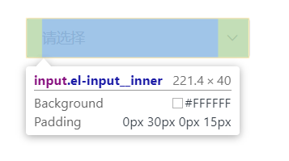
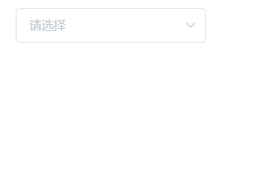
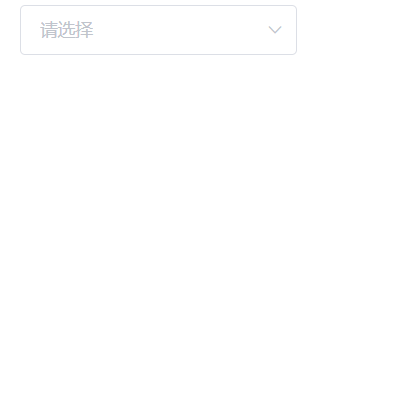

# Element中select自定义过滤函数 
## 引言

Element中的el-select组件使用非常方便。
```html
<el-select
    filterable
    v-model="value"
    placeholder="请选择">
    <el-option
        v-for="item in options"
        :key="item.value"
        :label="item.label"
        :value="item.value">
    </el-option>
</el-select>
```
像这样，就可以实现一个简单的选择器，并且带有输入框可以
根据用户输入过滤选项。
```javascript
export default {
    data() {
      return {
        value: '',
        options:[
          {label:'苹果',key:0},
          {label:'梨子',key:1},
          {label:'菠萝',key:2},
          {label:'香蕉',key:3},
        ]
      };
    }
  };
```  
但是有一个问题，默认的选择器只会根据label过滤内容，
如果我希望根据options中其他属性过滤应该怎么办呢？
  
## 变通方案

网上许多博客给出了一种变通的方案：绑定另一个数组。  
代码如下：
```html
<el-select
    filterable
    :filter-method="filterMethod"
    v-model="value"
    placeholder="请选择">
    <el-option
        v-for="item in otherOptions"
        :key="item.value"
        :label="item.label"
        :value="item.value">
    </el-option>
</el-select>
```
仔细看会发现，这时候v-for中遍历的不是原来的option了，
接着看js代码
```javascript
export default {
  data() {
    return {
      value: '',
      options:[
        {label:'苹果',eng:'pingguo'},
        {label:'梨子',eng:'lizi'},
        {label:'菠萝',eng:'boluo'},
        {label:'香蕉',eng:'xiangjiao'},
      ]
    };
  },
  methods:{
    filterMethod(query){
      if (query) {
        this.otherOptions = this.options.filter(item => {
          return (
            (item.label && item.label.indexOf(query) > -1) ||
            (item.eng && item.eng.indexOf(query) > -1)
          )
        })
      } else {
        this.otherOptions = this.options
      }
    }
  }
};
```
上述代码中，query是输入框中内容。  
这个逻辑也很简单，当输入内容的时候判断是否有过滤条件query，
如果没有那么otherOptions就是所有的options，
如果有，那么对item中label和eng属性做判断，如果符合条件，
则将这个item加入otherOptions。  
GIF  


## 思考
本来这样就可以正常使用了，但是如果数组比较大，
那么每次输入，都要遍历一遍整个数组吗？  
Element本身就可以对options进行筛选，他是怎么实现的呢？  
根据[element官方的指南](https://github.com/ElemeFE/element/blob/master/.github/CONTRIBUTING.zh-CN.md)，
首先clone下来，所有组件都在`package`目录下，通过修改`examples/play/index.vue`文件可以快速看到结果。  
修改后可以通过`npm run dev:play`并访问[http:localhost:8085](http:localhost:8085)查看修改结果。
## 源码
既然我们要研究的是select模块，那我们打开`package/select.vue`，一共八百多行代码，这次我们不需要全部阅读。  
在上面模板中，看到其中包含了许多内容，而我关心的只是官方是如何操作“每次输入触发过滤器进行过滤”的。  
所以我在打开`http:localhost:8085`，通过开发者工具找到了相关的HTML代码。如下：

<div align="center">
  
</div>
可以看到，这里有一个`<input>`，去`select.vue`中查找，找到如下定义：
```html
<input
    type="text"
    class="el-select__input"
    :class="[selectSize ? `is-${ selectSize }` : '']"
    :disabled="selectDisabled"
    :autocomplete="autoComplete || autocomplete"
    @focus="handleFocus"
    @blur="softFocus = false"
    @click.stop
    @keyup="managePlaceholder"
    @keydown="resetInputState"
    @keydown.down.prevent="navigateOptions('next')"
    @keydown.up.prevent="navigateOptions('prev')"
    @keydown.enter.prevent="selectOption"
    @keydown.esc.stop.prevent="visible = false"
    @keydown.delete="deletePrevTag"
    @compositionstart="handleComposition"
    @compositionupdate="handleComposition"
    @compositionend="handleComposition"
    v-model="query"
    @input="debouncedQueryChange"
    v-if="filterable"
    :style="{ 'flex-grow': '1', width: inputLength / (inputWidth - 32) + '%', 'max-width': inputWidth - 42 + 'px' }"
    ref="input">
```
于是我们发现：
1. 需要`filterable`存在才会渲染这个input
2. input绑定了query
3. input事件会触发debouncedQueryChange函数  
那么我们自然要去看一下`debouncedQueryChange`是个什么东西了。

跳转到函数定义处，查看代码。
```javascript
    this.debouncedQueryChange = debounce(this.debounce, (e) => {
      this.handleQueryChange(e.target.value);
    });
```
继续查看handleQueryChange。
```javascript
handleQueryChange(val) {
  if (this.previousQuery === val || this.isOnComposition) return;
  if (
    this.previousQuery === null &&
    (typeof this.filterMethod === 'function' || typeof this.remoteMethod === 'function')
  ) {
    this.previousQuery = val;
    return;
  }
  this.previousQuery = val;
  this.$nextTick(() => {
    if (this.visible) this.broadcast('ElSelectDropdown', 'updatePopper');
  });
  this.hoverIndex = -1;
  if (this.multiple && this.filterable) {
    const length = this.$refs.input.value.length * 15 + 20;
    this.inputLength = this.collapseTags ? Math.min(50, length) : length;
    this.managePlaceholder();
    this.resetInputHeight();
  }
  if (this.remote && typeof this.remoteMethod === 'function') {
    this.hoverIndex = -1;
    this.remoteMethod(val);
  } else if (typeof this.filterMethod === 'function') {
    this.filterMethod(val);
    this.broadcast('ElOptionGroup', 'queryChange');
  } else {
    this.filteredOptionsCount = this.optionsCount;
    this.broadcast('ElOption', 'queryChange', val);
    this.broadcast('ElOptionGroup', 'queryChange');
  }
  if (this.defaultFirstOption && (this.filterable || this.remote) && this.filteredOptionsCount) {
    this.checkDefaultFirstOption();
  }
}
```
代码比较长，慢慢来看。  
前半部分是一些判断，用途应该是减少执行次数、提高性能。  
第24行开始才是本文的重点：24行判断了filterMethod是否为function，
如果我们传入自定义的函数，就会在25行执行。  
27行进入else，也就是如果没有传入自定义函数，进入28-30行，
29、30行执行了broadcast函数，我们继续跟踪，去看下这个函数有什么用。
发现这个函数定义在`src/mixins/emitter.js`中，应该是个公用函数。
```javascript
function broadcast(componentName, eventName, params) {
  this.$children.forEach(child => {
    var name = child.$options.componentName;

    if (name === componentName) {
      child.$emit.apply(child, [eventName].concat(params));
    } else {
      broadcast.apply(child, [componentName, eventName].concat([params]));
    }
  });
}
```
大概作用是向指定的子组件遍历“广播”。
29行指定了向`ElOption`广播`queryChange`，并且带着`val`参数。
那么我们自然要去`ElOption`中看一下具体发生了什么。  
进入同级`option.vue`。
```html
<template>
  <li
    @mouseenter="hoverItem"
    @click.stop="selectOptionClick"
    class="el-select-dropdown__item"
    v-show="visible"
    :class="{
      'selected': itemSelected,
      'is-disabled': disabled || groupDisabled || limitReached,
      'hover': hover
    }">
    <slot>
      <span>{{ currentLabel }}</span>
    </slot>
  </li>
</template>
```
下面是JavaScript代码，删去部分无关代码。
```javascript
<script type="text/babel">
  export default {
    props: {
      value: {
        required: true
      },
      disabled: {
        type: Boolean,
        default: false
      }
    },
    data() {
      return {
        index: -1,
        visible: true,
      };
    },
    methods: {
      queryChange(query) {
        this.visible = new RegExp(escapeRegexpString(query), 'i').test(this.currentLabel) || this.created;
        if (!this.visible) {
          this.select.filteredOptionsCount--;
        }
      }
    },
    created() {
      this.$on('queryChange', this.queryChange);
    }
  };
</script>
```
代码比较简单。刚才广播了`queryChange`，那我们找一下。
在`created()`中发现，广播`queryChange`时会执行`queryChange`。
其中`queryChange`在19行，`query`是传入的查询条件。  
代码中通过正则的方式，判断query是否包含在本组件的`currentLabel`中，
然后修改`this.visible`来控制显示或隐藏。  
这也符合正常思路：用户进行筛选的时候，除非是远程动态获取options，否则
options本体应该不变，变化的只是结果。
像我们上面的[变通方案](/frontend/select.html#变通方案)，
在每一次输入时都有可能改变v-for所绑定的数据，然后触发reflow，实在是南辕北辙。

## 实现自己的函数
既然整个流程了解了，那么实现起来也很容易，
让`select`组件进行自己的广播，比如广播`myQueryChange`，
`option`组件听到广播后执行自己的函数`myQueryChange()`来动态修改`option.visible`。
于是我们回到`index.vue`，编写我们自己的filterMethod。  
初步想法是传入val，然后根据val修改visible。  
假设我们的数据结构是
```javascript
data:[
    {label:'苹果',eng:'apple'},
    {label:'梨子',eng:'pear'},
    {label:'菠萝',eng:'pineapple'},
    {label:'香蕉',eng:'banana'},
    ...
]
```
我们想让用户无论输入中文还是英文都能返回相应的数据。函数如下：
```javascript
filterMethod(val){
  return function(that){
    let fn=function(query,that){
      that.visible = that.myItem.eng.indexOf(query)>-1||
      that.myItem.label.indexOf(query)>-1
      if (!that.visible) {
        that.select.filteredOptionsCount--;
      }
    }
    that.broadcast('ElOption', 'myQueryChange', [val,fn]);
  }
}
```
返回一个匿名函数，函数传入that，在这里充当原函数的this，将我们自己的`filterMethod`
绑定`:filter-method="filterMethod"`  
进入`select.vue`，继续修改。  
```javascript
else if (typeof this.filterMethod === 'function') {
    let method = this.filterMethod(val);
    method(this);
    this.broadcast('ElOptionGroup', 'queryChange');
}
```
修改之前代码25行的位置，如果传入了`filterMethod`，我们将此时的this传给他。
这里将会执行
```javascript
that.broadcast('ElOption', 'myQueryChange', [val,fn]);
```
并且将val和fn通过广播传播出去，其中fn()就是我们自定义的业务代码。
到了`option.vue`中，监听广播`myQueryChange`，然后触发自己的函数
```javascript
myQueryChange(query, fn) {
  fn(query, this);
}
```
这里我们简单的执行`fn()`即可。记得传入query和that哦。  

## 结果  

然后尝试一下？  
<div align="center">
  
</div>

实现了我们需要的功能。

## 性能
有个有趣的问题：如果这个option非常大怎么办呢？  
那我们试一下呗！  
我们先写一个函数用于生成`options`。
```javascript
function optionsGenerator(num) {
    let ops = [];
    for (let i = 0; i < num; i++) {
        let oddEven = i % 2 === 0 ? 'even' : 'odd';
        let op = {label: '用户' + i, eng: 'user-' + oddEven};
        ops.push(op);
    }
    return ops;
}
let ops = optionsGenerator(10000);

export default { 
  data() {
    return {
        value: '',
        options: '',
        optionFilter:''
    };
  },
  methods: {
      oldFilterMethod(query) {
         if (query) {
           this.optionFilter = this.options.filter(item => {
             return (
               (item.label && item.label.indexOf(query) > -1) ||
               (item.eng && item.eng.indexOf(query) > -1)
             )
           })
           } else {
             this.optionFilter = this.options
           }
      }
  },
  mounted() {
    this.options = ops
    this.optionFilter = ops
  }
}
```
在`mounted()`中将生成的数据赋给options和optionsFilter，
通过改变`optionsFilter`来改变下拉框的数据。  
在数据量不大的时候，速度都很快，那么如果数据有一万条呢？
<div align="center">
  
</div>
可以看到，每次输入、删除之后，都会有一段时间的卡顿，
那么如果使用我们上面的方法呢？  
结果如下：
<div align="center">
  
</div>

## 原因分析
因为都是需要监听用户输入，在这一步都可以做防抖节流等操作，
真正的区别在于如何执行filterMethod方法。  

* 变通方案中，绑定了一个新的数组，在一次执行过程中，
完整遍历了一次数组，然后VUE需要根据遍历结果再完整渲染一次列表，
时间复杂度为O(n)；
* 而新方法中，虽然每次执行也是要完整遍历一次数组，时间复杂度也是O(n)，
但是不需要渲染原有的列表，只需要执行`option.visible=false`，
模板中`v-show="visible"`，也就是说不需要的属性被隐藏了，
reflow的开销较小。

## 总结

本次性能优化效果很明显，主要的性能瓶颈不在于JavaScript的执行，
而在浏览器的渲染上，可以看出，如何减少回流和重绘，
是前端性能优化的一个重要方向。

